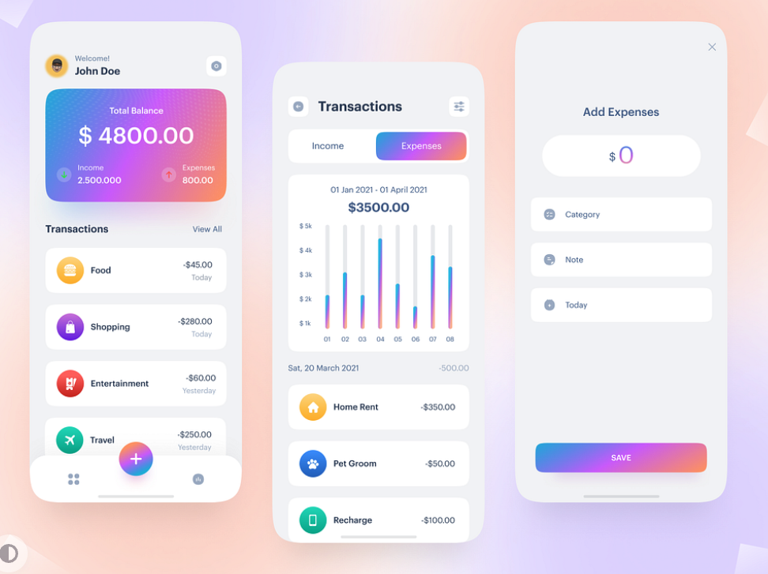

# Expense Tracker App

## Getting Started

Here is a screenshot of the app design , the app is still under development 

## Features

- Add Expense
- Add Category
- View Expense
- View Category
- View Expense by Category
- View Expense by Date

## Installation

- Clone the repository
- Run `flutter pub get`
- Run `flutter run`

## Technologies

- Flutter
- Bloc state management
- FireStore as database 
- Flutter Lints

Made with ❤️ by [Kevin Nkusi](https://github.com/nkusikevin)